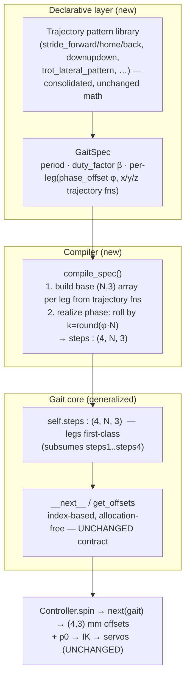

# refactor: Gait Core — 4-Independent-Leg Phasing Model

## Summary

Generalize the Vega gait core from "2 welded leg-groups" to **4 independently-phased legs**, and make phasing **explicit** via a declarative `(period, duty_factor β, phase_offset[4])` gait spec compiled into the existing precomputed step arrays. This breaks the `get_offsets` ceiling that makes one-leg-at-a-time wave gaits inexpressible, and converges the "1.5 gait systems" onto a single declarative path — **without changing the foot trajectories of trot, sidestep, or turn**. It is item 3 of the gait-stability ideation; it unblocks item 4 (prowl wave-gait rebuild) and does not itself fix the systemic planted-foot skid (that is foot-trajectory shaping, deferred).

This is a **behavior-preserving structural refactor**. "Behavior-preserving" is defined operationally: `test/test_gaits.py` invariants stay green, per-gait foot trajectories stay byte-identical to captured baselines, and `test_kinematics.py` stays green. The prowl `xfail` stays `xfail` — flipping it is item 4's job, not this plan's.

---

## Problem Frame

The base `Gait` class (`src/motion/gaits/gait.py`) emits per-leg offsets through `get_offsets`, which returns `[steps1, steps2, steps1, steps2]` unless the rarely-used `steps3`/`steps4` slots are populated. Consequences:

- **The ceiling:** legs are welded into 2 diagonal groups (`{0,2}` share `steps1`, `{1,3}` share `steps2`). A gait where each leg has an independent phase — the definition of a static wave/crawl gait — cannot be expressed in the default path. This is the wall blocking a stable prowl (ideation Goal 3).
- **Implicit phasing:** the 50%-offset between diagonal pairs is hand-coded as `np.roll(arr, num_steps*2)` inside each gait's `build_steps`. There is no phase-offset or duty-factor concept; phasing is a magic roll constant repeated per gait.
- **The "1.5 systems":** a declarative path exists (`SimplifiedGait` + `LegMovement`/`phase_shift`), but its `build_steps` consumer only reads legs 0 and 1 and writes only `steps1`/`steps2` — so even a 4-key declarative dict collapses to 2 groups. Meanwhile the production trot (`SimpleTrotWithLateral`) bypasses `SimplifiedGait` entirely and re-inherits `Gait` to hand-build arrays. The declarative schema is right; its consumer is the bottleneck.

The fix is to make 4-leg independence first-class, lift the implicit `np.roll` phasing into an explicit phase model grounded in the standard `(β, φ[4])` formulation, and route all production gaits through one compiler — while reproducing today's trajectories exactly.

---

## Requirements

Traced to `docs/ideation/2026-05-30-gait-stability-ideation.md` (Recommended Sequence #3, Goal 1):

- **R1.** Each of the 4 legs can carry an independent phase offset and foot trajectory (break the 2-group ceiling). *(ideation: "Enable 4-independent-leg movement")*
- **R2.** Phasing is expressed by an explicit, declarative model — per-gait `period` + `duty_factor β` + per-leg `phase_offset φ[i]` — not implicit `np.roll` constants. *(ideation: "explicit phase-offset + duty-factor model"; Rejection Summary #2 folds duty-factor in here)*
- **R3.** The production gaits (trot family, sidestep, turn) are expressed through one declarative compiler ("converge the 1.5 systems"), each producing **byte-identical** foot trajectories to today.
- **R4.** A one-leg-at-a-time wave gait is demonstrably **expressible** on the new core (proof that the ceiling is actually broken), without being wired into production.
- **R5.** Behavior preservation is verified by the existing harness (`test/test_gaits.py`, `test/test_kinematics.py`) plus exact-array baselines; the `test_prowl_planted_feet_do_not_skid` xfail remains xfail.

**Explicit non-requirements** (preserve, do not "improve"): the load-bearing y-sign flip (`steps2_y = -roll(y, …)`) and static stance offsets that compensate the unmirrored coxa; the IK/FK math and coxa convention; the index-based iterator contract consumed by `Controller`.

---

## High-Level Technical Design

The refactor inserts a **declarative spec → compiler** layer above the unchanged index-based iterator. Timing (phase) is separated from trajectory shape, mirroring the MIT Cheetah / Stanford Pupper model — but trajectory shape stays exactly as the current pattern functions produce it (Bezier shaping is deferred).

**Phase realization (the behavior-preserving bridge).** Current gaits encode the diagonal offset as `np.roll(arr, num_steps*2)` over a cycle of `N = num_steps*4` ticks. In the phase model that is exactly `φ = 0.5 → k = round(0.5·N) = num_steps*2`. The wave precedent `graveyard/gaits/tiger_run.py` uses `np.roll` by `num_steps*{1,2,3}` = `φ ∈ {0.25, 0.5, 0.75}`. So realizing `phase_offset` as an integer tick-roll **reproduces the existing rolls bit-for-bit** while making them explicit and per-leg.

**Contact schedule (for the wave proof and future work).** Standard formulation, leg-local: `local_phase(θ,i) = (θ + φ[i]) mod 1`; `in_stance = local_phase < β`; `swing_phase = (local_phase − β)/(1 − β)`. Duty factor is carried as declared metadata and used to *construct* the wave gait (U4) and to assert consistency with each migrated gait's lift window — it is **not** used to regenerate existing trajectories (that would change behavior).

**Diagonal pairing (authoritative).** `get_offsets`'s `[s1,s2,s1,s2]` welds `{0,2}` and `{1,3}`; with the leg map `0=FL,1=FR,2=BR,3=BL` those are the true trot diagonals (FL+BR, FR+BL). `CLAUDE.md`'s textual "(0,3) and (1,2)" is **stale** (that's lateral pairs) — corrected as a doc fix in U8.

---

## Key Technical Decisions

**KTD1 — Keep the index-based precomputed-array iterator; realize phase as an integer tick-roll.**
Realize `phase_offset φ` as `k = round(φ · N)` and `np.roll(base, k, axis=0)`. This reproduces every existing `np.roll(…, num_steps*2)` exactly, keeps the hot path allocation-free, and leaves the `Controller` contract untouched. *Alternative — a continuous-phase runtime scheduler (Cheetah/Pupper style) — rejected here:* it cannot guarantee byte-identical output and would touch the controller; recorded as a possible future evolution (Alternatives).

**KTD2 — Adopt the canonical `(period, duty_factor β, phase_offset[4])` spec, but extract values from existing patterns rather than imposing textbook ones.**
Per the MIT Cheetah / Stanford Pupper / McGhee lineage, this triple is the minimal complete gait spec. For migration we **derive** each gait's effective `φ` (from its current roll) and `β` (from its current lift-window fraction) and assert them — we do not normalize gaits toward textbook β. Preserve behavior, not tidy theory.

**KTD3 — Unify `steps1..steps4` into a single `self.steps : (4, N, 3)` indexed by leg; `get_offsets` becomes a plain index.**
Makes 4-leg independence first-class and subsumes both the welded default and `Turn`'s ad-hoc `steps3/4`. A thin back-compat shim (`steps1..steps4` as views/properties onto `self.steps`) keeps un-migrated gaits working during the incremental migration.

**KTD4 — Preserve the load-bearing "weirdness" in the gait layer.**
The y-sign flip and static stance offsets compensate the deliberately-unmirrored coxa and live in the gait/spec layer, never in kinematics. The spec schema carries per-leg y-trajectories (a leg can declare `-y` of another), which expresses the flip without a magic post-roll negation.

**KTD5 — "Behavior-preserving" is defined by tests, and the prowl xfail stays xfail.**
Gate every migration on: `test_gaits.py` invariants green, exact-array equality vs. a captured pre-refactor baseline, `test_kinematics.py` green. `test_prowl_planted_feet_do_not_skid` must remain `xfail` (item 4 owns flipping it). Trajectory shaping / skid reduction is explicitly out of scope.

---

## Implementation Units

Units are dependency-ordered. Migrations (U5→U7) are independently landable and revertible, each harness-gated, per the confirmed incremental approach.

### U1. Phase model + GaitSpec schema + phase math utilities

**Goal:** Add the declarative vocabulary and the phase math, as pure additions (no behavior change, nothing wired in yet).
**Requirements:** R1, R2.
**Dependencies:** none.
**Files:**
- `src/motion/gaits/gait_spec.py` (new) — `GaitSpec` (period/`N`, `duty_factor`, per-leg `LegSpec` of phase_offset + x/y/z trajectory callables) and `LegSpec`.
- `src/motion/gaits/phase.py` (new) — `local_phase`, `in_stance`, `swing_phase`, `phase_to_ticks(φ, N)`.
- `test/test_phase_model.py` (new).
**Approach:** Keep schemas plain dataclasses mirroring the existing `LegMovement`/`phase_shift` shape (so `graveyard/gaits/experimental_gaits.py` dicts map over cleanly). `phase_to_ticks` is `round(φ · N)` with documented wrap semantics (`φ` taken mod 1). No NumPy state, no I/O.
**Patterns to follow:** `LegMovement` dataclass in `src/motion/gaits/simplified_gait.py`; the `(β, φ[4])` formulation from Sources.
**Test scenarios:**
- `phase_to_ticks(0.0/0.25/0.5/0.75, N=24)` → `0/6/12/18` (matches `tiger_run` rolls).
- `phase_to_ticks(1.0, N)` == `phase_to_ticks(0.0, N)` (wrap) and negative/`>1` φ normalize.
- `in_stance`: at β=0.75, leg with φ=0 is in stance for exactly 75% of sampled θ∈[0,1); in swing for 25%.
- `swing_phase` ranges [0,1) across the swing window and is undefined-guarded during stance (documented return).
- Wave tiling: β=0.75, φ=[0,.25,.5,.75] → at every sampled θ exactly one leg is in swing.
**Verification:** New unit tests pass; no production import of the new modules yet.

### U2. Generalize the base Gait core to 4 first-class legs

**Goal:** Replace the `steps1..steps4` special-casing with a single `self.steps : (4, N, 3)`, while keeping every existing gait's `get_offsets` output identical.
**Requirements:** R1, R3.
**Dependencies:** U1.
**Files:**
- `src/motion/gaits/gait.py` — introduce `self.steps`; rewrite `get_offsets` to `return self.steps[:, index]`; add back-compat: `steps1..steps4` become properties/views that read/write `self.steps[0/1/2/3]`, and the legacy `build_steps` outputs are assembled into `self.steps` (welded default `[s1,s2,s1,s2]` preserved when only `steps1/2` are set).
- `test/test_gait_core.py` (new) — old-vs-new equivalence.
**Approach:** The welded default must survive for un-migrated gaits: if a gait sets only `steps1`/`steps2`, assemble `self.steps = [s1, s2, s1, s2]`; if it also sets `steps3`/`steps4` (Turn, tiger_run), use all four. Keep `shape`, `size`, `max_index`, `__next__`, `get_positions` semantics intact (`max_index = N`).
**Execution note:** Characterization-first — capture baseline `get_offsets`/`__next__` output for all 7 production gait configs *before* editing, assert equality after.
**Patterns to follow:** existing `get_offsets` branch in `src/motion/gaits/gait.py`; `Turn`'s steps3/4 usage in `src/motion/gaits/turn.py`.
**Test scenarios:**
- For each of the 7 configs in `test/test_gaits.py` `GAITS`: full-cycle frame sequence is identical pre/post (byte-equal arrays).
- A gait setting only `steps1/steps2` still welds `{0,2}`/`{1,3}`.
- A gait setting `steps1..steps4` (Turn) yields 4 independent leg columns unchanged.
- `steps1` property write reflects into `self.steps[0]` and vice versa (shim correctness).
- `test/test_gaits.py` and `test/test_kinematics.py` unchanged and green.
**Verification:** Equivalence test green for all configs; existing harness green; `SKID_CEILING_MM` unchanged.

### U3. GaitSpec compiler + trajectory pattern consolidation

**Goal:** Compile a `GaitSpec` into a `(4, N, 3)` `self.steps` array, realizing phase as a tick-roll; consolidate the duplicated trajectory pattern functions into one referenced library.
**Requirements:** R2, R3.
**Dependencies:** U1, U2.
**Files:**
- `src/motion/gaits/gait_spec.py` — `compile_spec(spec, N) -> np.ndarray (4,N,3)`.
- `src/motion/gaits/trajectories.py` (new) — single home for `stride_forward/home/back`, `stride_front_to_back`, `downupdown`, `trot_lateral_pattern`, lift/step_cycle; re-exported so `Gait` and `MovementPattern` reference one source.
- `test/test_gait_spec.py` (new).
**Approach:** `compile_spec` builds each leg's base `(N,3)` from its x/y/z callables, then `np.roll(base, phase_to_ticks(φ, N), axis=0)`. The y-sign flip is expressed as a leg declaring `-y` of its pair (KTD4), not a post-hoc negation. Consolidate patterns by moving the bodies into `trajectories.py` and having `Gait.*` / `MovementPattern.*` delegate, so no math changes (assert via existing harness).
**Patterns to follow:** `graveyard/gaits/tiger_run.py` (roll-by-k = phase); `MovementPattern` and `Gait.stride_*` (the functions being consolidated).
**Test scenarios:**
- Compiling a 2-group spec (φ=[0,.5,0,.5], trot trajectories) byte-equals a hand-rolled `[s1, roll(s1,N/2)]`-derived array.
- Compiling a 4-leg spec with φ=[0,.25,.5,.75] equals `tiger_run`'s `steps1..4` rolls.
- Per-leg y-sign: a leg declaring `-y` produces the negation of its pair's y column.
- Consolidation parity: `Gait.stride_forward()` etc. return identical arrays to the pre-move versions (regression guard).
- Compiler output shape is always `(4, N, 3)`; integer dtype matches `reshape_steps` output.
**Verification:** Spec-compile equality tests green; trajectory consolidation leaves `test/test_gaits.py` byte-identical.

### U4. Wave-gait expressibility proof (test-only)

**Goal:** Demonstrate the ceiling is actually broken: construct a one-leg-at-a-time wave gait via `GaitSpec` and show it satisfies the core invariants — without wiring it into the controller.
**Requirements:** R4.
**Dependencies:** U1, U2, U3.
**Files:**
- `test/test_wave_gait_expressibility.py` (new) — builds a β=0.75, φ=[0,.25,.5,.75] spec from simple stride/lift trajectories and a stance `p0`.
**Approach:** Pure test fixture (no production gait class, no controller change). Assert it produces valid, reachable, periodic motion with exactly one leg swinging at a time — the property that was previously inexpressible.
**Test scenarios:**
- Frame contract `(4,3)` finite across a full cycle.
- All feet reachable through the cycle (`km.validate_position`).
- Periodic over `N` steps.
- At most one leg lifted (offset_z below stance) at any tick — the wave property.
- The same spec is **not** expressible through the legacy welded path (assert the 2-group path collapses it), documenting the ceiling that was removed.
**Verification:** Wave proof test green; no diff to production gait behavior; not registered in `controller._get_gait_factory`.

### U5. Migrate the trot family to GaitSpec (byte-identical)

**Goal:** Re-express `Trot` (used by `trot_in_place`) and `SimpleTrotWithLateral` (production forward/backward) as `GaitSpec`s producing identical foot trajectories.
**Requirements:** R3, R5.
**Dependencies:** U3.
**Files:**
- `src/motion/gaits/trot.py`, `src/motion/gaits/simplified_gait.py` (SimpleTrotWithLateral) — build via `GaitSpec`/`compile_spec`.
- `test/test_gait_migration_trot.py` (new) — exact-array baseline.
**Approach:** Derive φ=0.5 (current `roll num_steps*2`) and the lift-window β; declare legs `{0,2}` and `{1,3}` with the trot trajectories, legs `{1,3}` carrying `-y` (preserve the load-bearing flip). Capture pre-migration baseline arrays first.
**Execution note:** Characterization-first — snapshot full-cycle output for `trot_fwd`, `trot_in_place` (and reverse) before editing; assert byte-equality after.
**Patterns to follow:** current `SimpleTrotWithLateral.build_steps` (the `-np.roll(y,…)` flip) and `Trot.build_steps`.
**Test scenarios:**
- `trot_fwd`, `trot_in_place`, backward variant: full-cycle frames byte-equal to baseline.
- `SKID_CEILING_MM['trot_fwd']`/`['trot_in_place']` unchanged; reachability + periodicity green.
- y-sign flip preserved: legs 1,3 y-column equals `−` legs 0,2 (post-roll).
- `test/test_gaits.py` green for all trot configs.
**Verification:** Migration equality test green; harness unchanged.

### U6. Migrate sidestep to GaitSpec (byte-identical)

**Goal:** Re-express `SimpleSidestep` via `GaitSpec`, honoring all 4 legs.
**Requirements:** R3, R5.
**Dependencies:** U3 (independent of U5).
**Files:**
- `src/motion/gaits/simplified_gait.py` (SimpleSidestep) — build via `GaitSpec`.
- `test/test_gait_migration_sidestep.py` (new).
**Approach:** `SimpleSidestep` already declares a 4-leg `LegMovement` dict with `phase_shift` — map it onto `GaitSpec` directly (this is the first real exercise of the 4-leg consumer that the old `SimplifiedGait.build_steps` collapsed). Preserve `is_reversed` handling for LEFT/RIGHT.
**Execution note:** Characterization-first — baseline `sidestep_R` and `sidestep_L`.
**Patterns to follow:** `SimpleSidestep.define_leg_movements`; `graveyard/gaits/experimental_gaits.py` 4-leg `phase_shift` dicts.
**Test scenarios:**
- `sidestep_R`, `sidestep_L` byte-equal to baseline; `SKID_CEILING` unchanged.
- Both legs' phase_shift (half-cycle) realized correctly through the compiler.
- Reachability + periodicity green.
**Verification:** Migration equality test green; harness unchanged.

### U7. Migrate turn to GaitSpec (byte-identical)

**Goal:** Re-express `Turn` (already a true 4-leg gait via `steps3/4`) through `GaitSpec`.
**Requirements:** R3, R5.
**Dependencies:** U3 (independent of U5, U6).
**Files:**
- `src/motion/gaits/turn.py` — build via `GaitSpec`.
- `test/test_gait_migration_turn.py` (new).
**Approach:** Turn is the cleanest 4-independent-leg case (offsets at `num_steps*{0,1,2,3}` regions, `turn_direction` sign, `is_reversed`). Map its 4 step arrays to 4 `LegSpec`s. Preserve `turn_direction`/`is_reversed` parameterization used by `controller._get_gait_factory`.
**Execution note:** Characterization-first — baseline `turn_L`, `turn_R` and reversed variants.
**Patterns to follow:** `Turn.build_steps` (the canonical steps3/4 user).
**Test scenarios:**
- `turn_L`, `turn_R`, backward-turn variants byte-equal to baseline.
- 4 legs remain independently phased (no welding regression).
- `SKID_CEILING['turn_L/R']` unchanged; reachability + periodicity green.
**Verification:** Migration equality test green; harness unchanged.

### U8. Converge, retire duplication, and fix docs

**Goal:** Collapse the "1.5 systems" to one path, remove now-dead duplication, and correct stale docs.
**Requirements:** R3.
**Dependencies:** U5, U6, U7.
**Files:**
- `src/motion/gaits/simplified_gait.py` — make the declarative base honor 4 legs (or fold into the new spec base) now that all consumers route through `GaitSpec`; remove the legs-0/1-only `build_steps` bottleneck.
- `src/motion/gaits/gait.py` — retire the `steps1..steps4` back-compat shim from U2 once no gait sets them directly (or keep as deprecated, documented).
- `GAITS.md` — document the `GaitSpec` model, phase/duty vocabulary, and how to author a new gait declaratively; update the migration guide.
- `CLAUDE.md` — fix the stale "Diagonal pairs … (0,3) and (1,2)" line to the authoritative `{0,2}` and `{1,3}`.
**Approach:** Pure cleanup + docs; no behavior change. Leave `prowl.py` on its current path (item 4 rebuilds it) — note this explicitly in `GAITS.md` so the inconsistency is intentional and tracked.
**Test scenarios:** `Test expectation: none — convergence/cleanup + docs; covered by the full harness staying green (all configs byte-identical, reachability + periodicity, prowl xfail still xfail).`
**Verification:** `python3 -m pytest test/` shows the pre-refactor green set unchanged (prowl `xfail` preserved); no production gait references the retired path; `GAITS.md`/`CLAUDE.md` accurate.

---

## Scope Boundaries

**In scope:** the phase/duty/spec model, the 4-leg core generalization, the spec compiler + trajectory consolidation, a test-only wave-gait expressibility proof, and byte-identical migration of trot/sidestep/turn onto the new path.

### Deferred to Follow-Up Work
- **Prowl wave-gait rebuild + support-polygon / body-shift** (ideation item 4) — the first *production* consumer of the new core; flips the prowl xfail.
- **Foot-trajectory shaping (Bezier swing, zero-velocity touchdown)** — the general fix for the systemic planted-foot skid; the spec layer is designed to accept it but this plan does not change trajectory shape.
- **Continuous-phase runtime scheduler** (Cheetah/Pupper-style `getMpcTable`) — a possible future evolution once trajectories are shaped (see Alternatives).
- **`robot.py` `level()` auto-leveler review** — surfaced separately; unrelated to the gait core.

### Outside This Change (do not touch)
- IK/FK math and the unmirrored coxa convention (`src/motion/kinematics.py`).
- The `Controller` servo pipeline and IK call sites.
- The deliberate y-sign / stance-offset compensation (preserved, not refactored into kinematics).

---

## Risks & Mitigations

- **Silent behavior drift during migration.** *Mitigation:* capture exact-array baselines before each migration unit; assert byte-equality; keep `test_gaits.py` + `SKID_CEILING_MM` as a second gate. Migrations are independent and revertible.
- **Phase/duty extraction is lossy.** *Mitigation:* phase is realized as the *same* integer tick-roll the code already does (exact); duty is descriptive metadata asserted against the lift window, never used to regenerate trajectories.
- **Wrong leg-index→corner mapping** (docs disagree). *Mitigation:* derive welding from `get_offsets` (authoritative `{0,2}/{1,3}`), add an explicit assertion test, and fix the stale `CLAUDE.md` line in U8.
- **Back-compat shim hides a regression.** *Mitigation:* U2 ships the old-vs-new equivalence test for all 7 configs before any gait is migrated; shim removal (U8) is gated on no remaining direct `steps1..4` setters.
- **Graveyard oracles are stale / non-runnable.** *Mitigation:* use `tiger_run.py` / `experimental_gaits.py` as design references and test fixtures only, not as restored production code.

---

## Alternatives Considered

- **Continuous-phase runtime scheduler** (compute contact + foot target each tick from `(θ, β, φ)` à la MIT Cheetah / Stanford Pupper). Cleaner long-term and the industry direction, but it **cannot guarantee byte-identical output** and would rework the `Controller` consumer — both violating the behavior-preserving constraint of this refactor. Chosen path (compile-to-arrays, KTD1) gets the same declarative spec with zero consumer churn; the scheduler becomes a viable later evolution once trajectories are shaped.
- **Big-bang convergence** (migrate all gaits + delete the legacy path in one change). Rejected per the confirmed incremental approach — this code runs on hardware and the repo is burn-scarred; per-gait, harness-gated migration is revertible and lower-risk.
- **Migrate prowl now** for consistency. Rejected — prowl is rebuilt in item 4; migrating its current unstable implementation is throwaway work. It stays on the legacy path (documented in U8).

---

## Sources & Research

- **Local prior art:** `graveyard/gaits/tiger_run.py` (the only `steps3/4` user — phase = `np.roll` by `num_steps·k`, the exact tick-roll precedent); `graveyard/gaits/experimental_gaits.py` (`SimpleWalk`/`SimpleProwl` 4-leg `phase_shift` dicts — declarative schema precedent and U4/U6 fixtures); `docs/ideation/2026-05-30-gait-stability-ideation.md` (origin); `test/test_gaits.py` (behavior-preserving gate).
- **External (gait-core architecture):** MIT Cheetah `GaitScheduler` — `phaseOffset[4]`, `switchingPhase` (=β), `contactStateScheduled[4]` (https://mit-biomimetics.github.io/d1/d14/class_gait_scheduler.html). Stanford Pupper `contact_phases` matrix + `phase_ticks`, timing/shape decoupled (https://github.com/stanfordroboticsclub/StanfordQuadruped). CHAMP per-leg `PhaseGenerator`, config-driven (https://github.com/chvmp/champ). Notspot per-gait controllers — the anti-pattern being escaped (https://github.com/lnotspotl/notspot_sim_py).
- **Formulation:** McGhee & Frank lineage — gait = `(period, duty_factor β, phase_offset φ[4])`; `in_stance = (θ+φ[i]) mod 1 < β`; wave stability needs `β > (n−1)/n = 0.75` with offsets spaced `(1−β)`. Trajectory shape (Bezier swing) decoupled from timing — deferred here.

---

## Open Questions (deferred to implementation)

- Final module boundary: does `SimplifiedGait` get folded into a new `SpecGait` base (U8), or retained as a thin declarative facade over `GaitSpec`? Decide once U5–U7 reveal how much of `LegMovement` survives.
- Whether to keep the `steps1..steps4` shim as permanently-deprecated public API (some `graveyard`/notebook code references it) or remove it outright in U8.
- Exact home for the consolidated trajectory library (`trajectories.py` vs. extending `MovementPattern`) — settle in U3 based on import cleanliness.
