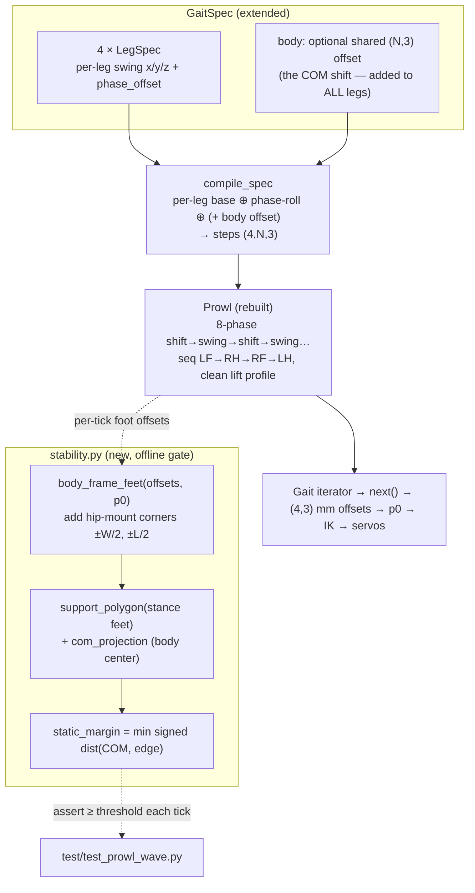

# feat: Prowl Static Wave Gait + Support-Polygon Stability

## Summary

Rebuild prowl as a **statically stable wave gait**: lift one leg at a time, in a canonical sequence, with a **body-shift sub-phase** that moves the COM into the standing 3-foot support triangle *before* each lift. Build it on the existing `GaitSpec` core, and add a new **stability primitive** (`src/motion/stability.py`) — support polygon + static stability margin (SSM) — used as the **offline test gate** that proves the gait keeps the COM inside the support triangle with positive margin at every tick. Forward and backward both get the full wave treatment (backward = negated stride). The waiting `test_prowl_planted_feet_do_not_skid` xfail flips to pass.

This is item 4 of the gait-stability ideation, downstream of the completed gait-core refactor (item 3). It replaces the current prowl — a slowed-down trot that lifts two opposite-corner feet at once and balances on a 2-point line, which is why it is unstable.

---

## Problem Frame

Current prowl (`src/motion/gaits/prowl.py`) mirrors trot's diagonal-pair coupling (lifts the `{0,2}` then `{1,3}` diagonals), so at any moment it stands on **two** feet forming a line through the COM — statically unstable with no momentum to recover. Cosmetic tuning (lower clearance, hip sway) cannot fix a slow 2-feet-down gait; the ideation's verdict is a structural rebuild as a static wave gait.

Two things must be built that do not exist today:

1. **A static wave gait** — one foot off the ground at a time (β ≥ 3/4), each lift preceded by a body-shift that keeps the COM projection inside the triangle of the three standing feet. The just-landed core proves this is expressible (`test/test_wave_gait_expressibility.py`), but a *production* gait with a real body-shift and controller wiring is new.
2. **A support-polygon / SSM primitive** — and critically, the **body-frame composition** it needs. The gait yields per-leg-frame foot offsets (each measured from that leg's own femur pivot); a support polygon requires all four feet in **one common body frame**. Nothing in the codebase does this — it is the load-bearing new geometry.

---

## Requirements

Traced to `docs/ideation/2026-05-30-gait-stability-ideation.md` (Goal 3 + Axis 1 "Static stability & support polygon"):

- **R1.** Prowl lifts exactly one foot at a time in a stable sequence; β ≥ 3/4 (McGhee static-stability minimum).
- **R2.** A body-shift sub-phase moves the COM into the standing 3-foot support triangle before each lift.
- **R3.** A stability primitive composes the four feet into a body frame, forms the support polygon of the stance feet, and computes the static stability margin (signed COM-to-nearest-edge distance).
- **R4.** An offline test asserts **min SSM ≥ threshold > 0 at every tick** of the prowl cycle (the geometric invariant the ideation calls testable without hardware). Runtime gating is **out of scope** (deferred).
- **R5.** Every foot stays reachable through the cycle; the gait is periodic; planted feet do not skid — `test/test_gaits.py::test_prowl_planted_feet_do_not_skid` (≤15 mm) **flips from xfail to pass**.
- **R6.** Forward and backward prowl both use the wave gait (backward = negated stride). Controller `MoveTypes.PROWL` / `PROWL_BACKWARD` keep working with no factory signature change.
- **R7.** trot / sidestep / turn behavior is unchanged (byte-identical), and the kinematics/coxa convention is untouched.

---

## High-Level Technical Design

Two new pieces sit beside the existing core: a **stability module** (pure geometry) and a **shared body-offset** extension to the spec compiler. The prowl gait choreographs an 8-phase discrete *shift-then-swing* cycle.



**The 8-phase cycle (discrete shift-then-swing, β ≈ 7/8 — the most robust "Intermittent Gait 1").** The cycle alternates a body-shift segment with a single-leg swing segment, four times:

```
shift→tri(L0) · swing L0 · shift→tri(L2) · swing L2 · shift→tri(L1) · swing L1 · shift→tri(L3) · swing L3
```

Each leg is airborne only during its swing segment (~1/8 of the cycle → β ≈ 7/8, well above the 3/4 minimum); three feet are always planted. `tri(Li)` is the triangle of the other three feet; the shift targets its **incenter** (maximizes the minimum edge distance).

**Body-shift representation.** A shared body offset is *not* a per-leg phase roll — at a given tick it is the same for every leg. So it is a first-class `body` field on `GaitSpec`, added to all four legs by `compile_spec` (default `None` → no-op, existing gaits unchanged). This mirrors the literature's separation of body-sway from leg-swing and keeps the lateral compensation in the gait layer, never kinematics.

**Why planted feet stop skidding.** The old prowl reset a loaded foot ~40 mm in one step (a teleport). The wave gait moves planted feet only via the *smooth* body-shift (spread across a segment → small per-step deltas), and swings each foot with a clean `trajectories.lift` profile (not `downupdown`, which presses down and causes the reset). Small per-step planted deltas clear the 15 mm skid target.

---

## Key Technical Decisions

**KTD1 — The stability primitive composes feet into a BODY frame; per-leg frame is meaningless for a support polygon.**
Gait offsets and `p0` are per-leg (each foot measured from its own femur pivot — `position_prowl` is `[0,0,113]` for *all* legs). `stability.py` adds the hip-mount corner offsets from the leg map (`0=FL,1=FR,2=BR,3=BL` → `(±length/2, ±width/2)`, confirmed by `apply_body_tilt`'s yaw `[1,1,-1,-1]`/pitch `[1,-1,-1,1]` sign patterns) and the X-inversion, producing foot XY in one body frame. **COM = body geometric center** with an optional calibrated static offset (the CHAMP/spotMicro pattern — a tuning constant, not sensing). This body-frame convention is the load-bearing new geometry and is captured as a docs learning (U5).

**KTD2 — SSM via signed point-to-edge distance; COM projection suffices; offline gate only.**
For the stance triangle `(F0,F1,F2)` and COM projection `C` (all body-frame XY): `d_i = cross(Fj−Fi, C−Fi) / |Fj−Fi|`; `SSM = min(d_i)`; positive (consistent winding) = COM inside, the margin is the tip-over distance. For quasi-static crawl, ZMP ≈ COM projection (multiple sources), so the static test is correct and sufficient. Per the confirmed scope, the primitive is used **only as a test-time gate**; a runtime guard in the controller is deferred (it raises the separate "what to do on violation" closed-loop problem).

**KTD3 — Body-shift as an optional shared `body` offset on `GaitSpec`, added by `compile_spec`.**
Additive and default-`None`, so trot/sidestep/turn compile byte-identically (regression-guarded by the existing migration tests). Separates "where the body is" from "where each foot swings." Keeps left/right asymmetry as gait-layer y-sign (per the unmirrored-coxa convention; never in kinematics).

**KTD4 — 8-phase discrete shift-then-swing, sequence LF→RH→RF→LH, incenter COM target, clean lift profile.**
Discrete shift-then-swing is more stable and simpler than continuous (notspot/spotMicro; MDPI "most robust"). Sequence `0→2→1→3` (LF→RH→RF→LH for this leg map) is the canonical lateral-sequence walk (hind-before-fore per side); the static-margin test is the arbiter — if another rotation yields larger min-SSM, adopt it. Incenter target maximizes the minimum margin. Use `trajectories.lift` for swing, not `downupdown` (which causes the planted-foot reset).

**KTD5 — Replace `Prowl` in place; backward = negated stride; the xfail flips via smoothness.**
Keep the `Prowl` class name and `(p0, params)` constructor so `controller._get_gait_factory` is unchanged. Backward reuses the existing `prowl_reverse_params` (stride already negative). The skid xfail passes because the body-shift is *smooth* (small per-step planted deltas), not because planted feet are frozen.

---

## Implementation Units

### U1. Stability primitive: body-frame composition + support polygon + SSM

**Goal:** A pure-geometry module that places the four feet in a common body frame, forms the stance support polygon, and computes the static stability margin.
**Requirements:** R3.
**Dependencies:** none.
**Files:**
- `src/motion/stability.py` (new) — `body_frame_feet(offsets, p0)`, `support_margin(feet_xy, stance_mask, com_xy=None)`, helpers (incenter, signed edge distance), hip-mount corner constants derived from `settings.robot_width/length`.
- `test/test_stability.py` (new).
**Approach:** Hip-mount corners from the leg map (`(±length/2, ±width/2)`); compose body-frame foot XY = corner + per-leg foot offset (accounting for the IK X-inversion; Z is the vertical/contact axis, ignored for the ground-plane polygon). COM defaults to body origin `(0,0)` plus an optional static offset constant. `support_margin` takes which legs are in stance, builds the triangle, returns `min` signed edge distance (negative = COM outside). No NumPy state beyond array math; no I/O.
**Execution note:** Build and unit-test this in isolation before the gait — it is the new, easy-to-get-wrong geometry.
**Patterns to follow:** `apply_body_tilt` leg-corner sign patterns in `src/motion/kinematics.py`; the SSM algorithm in Sources.
**Test scenarios:**
- Known square stance (feet at the four corners) → COM at center → margin equals half the corner spacing; COM nudged toward an edge → margin shrinks accordingly.
- Stance triangle (one leg lifted): COM inside → positive margin; COM placed exactly on an edge → margin ≈ 0; COM outside → negative margin.
- Edge case — **collinear/degenerate** stance (three near-collinear feet) → margin ≈ 0 or flagged, not a divide-by-zero or NaN.
- Incenter of a known triangle matches the analytic incenter; incenter is the point maximizing the minimum edge distance.
- Body-frame composition: two feet at identical per-leg offsets land at their distinct physical corners (≈ `width`/`length` apart), not the same point.
- Static COM offset shifts the margin by the expected amount in the expected direction.
**Verification:** `test_stability.py` green; margins match hand-computed values for known geometries.

### U2. GaitSpec shared body-offset extension

**Goal:** Let a gait carry a shared body trajectory added to every leg, without changing any existing gait's output.
**Requirements:** R2, R7.
**Dependencies:** none (independent of U1).
**Files:**
- `src/motion/gaits/gait_spec.py` — add optional `body` (an `(N,3)` array or a callable) to `GaitSpec`; `compile_spec` adds it to every leg's compiled steps. `None` → unchanged.
- `test/test_gait_spec.py` — body-offset tests.
**Approach:** After per-leg compile + phase-roll, add the shared `body` offset (broadcast across legs) when present. Cast/round consistently with the existing int path. Default `None` keeps the welded/rolled output identical.
**Execution note:** Characterization-first — assert trot/sidestep/turn compile byte-identically with `body=None` before adding the additive path.
**Patterns to follow:** existing `compile_spec` in `src/motion/gaits/gait_spec.py`.
**Test scenarios:**
- `body=None`: a known spec compiles identically to the pre-change output (byte-equal).
- `body` constant offset: every leg's steps shift by exactly that offset; per-leg swing differences preserved.
- `body` time-varying: leg `i` at tick `t` = its per-leg compiled value + `body[t]`.
- Existing migration tests (`test_gait_migration_*`) and `test_gaits.py` stay green (no regression for trot/sidestep/turn).
**Verification:** body-offset tests green; all existing gait tests unchanged.

### U3. Rebuild Prowl as the static wave gait

**Goal:** Replace prowl's imperative `build_steps` with an 8-phase shift-then-swing wave gait via `GaitSpec` (forward + backward).
**Requirements:** R1, R2, R6, R7.
**Dependencies:** U2 (needs the body offset).
**Files:**
- `src/motion/gaits/prowl.py` — rewrite `Prowl` to build via `GaitSpec`/`compile_spec`: per-leg `lift` swing in each leg's swing segment (sequence `0→2→1→3`), shared `body` trajectory implementing the COM shift toward each upcoming triangle's incenter, clean `trajectories.lift` profile.
- `settings.py` / `settings.yml` — prowl tuning: body-shift magnitude (new param), reuse `prowl_params`/`prowl_reverse_params`, `position_prowl`.
- `test/test_prowl_wave.py` (new) — structural tests (sequence, one-foot-at-a-time, backward = negated stride).
**Approach:** 8 segments (4 shift + 4 swing). Compute, per swing, the incenter of the other three feet's stance positions (using U1's body-frame composition at design/compile time) and set the body trajectory to translate the COM toward it before that leg lifts. Backward negates stride (already in `prowl_reverse_params`). Keep the `Prowl(p0, params)` signature.
**Technical design (directional):** body-shift target per swing = incenter of the 3 stance feet in body frame; body trajectory interpolates between successive incenters across the shift segments; swing leg follows `lift`-profiled z plus a stride in x/y to its next foothold.
**Patterns to follow:** `test/test_wave_gait_expressibility.py` (the proven wave fixture); `Turn` in `src/motion/gaits/turn.py` (explicit per-leg segmented trajectories); `trajectories.lift`.
**Test scenarios:**
- Exactly one foot airborne at any tick (z below stance); the other three planted.
- Lift order matches the chosen sequence `0→2→1→3`.
- Backward prowl = forward with negated stride (foot translation reversed; lift sequence and body-shift structure identical).
- Gait is periodic over its cycle length; frame contract `(4,3)` finite.
- Body-shift is smooth: planted-foot per-step horizontal delta stays small (sets up R5).
**Verification:** `test_prowl_wave.py` green; prowl visibly one-leg-at-a-time with a body-shift; backward symmetric.

### U4. Stability gate + behavior tests + flip the xfail

**Goal:** Prove the rebuilt prowl is statically stable and well-behaved, and flip the skid xfail.
**Requirements:** R4, R5, R6.
**Dependencies:** U1, U3.
**Files:**
- `test/test_prowl_wave.py` — add the stability gate using `stability.py`.
- `test/test_gaits.py` — remove the `xfail` marker from `test_prowl_planted_feet_do_not_skid` (now passes); revisit `SKID_CEILING_MM['prowl']` (tighten to the new, smaller value).
- `src/nodes/controller.py` — verify (no change expected) `PROWL` / `PROWL_BACKWARD` still construct `Prowl`.
**Approach:** For every tick, compose body-frame feet (U1), determine stance feet from the phase schedule (`phase.in_stance` or the z-profile), assert `support_margin ≥ threshold` (threshold a small positive mm, documented/tunable). Keep the existing reachability + periodicity invariants.
**Test scenarios:**
- **Static-margin gate:** `min SSM ≥ threshold` at every tick, forward and backward. *Covers the R4 geometric invariant.*
- **Skid target:** `test_prowl_planted_feet_do_not_skid` passes (planted skid ≤ 15 mm) — xfail removed.
- All feet reachable through the cycle (`validate_position`); gait periodic.
- Edge case — a body-shift that would push a stance foot out of reach is caught by the reachability assertion (tune so it does not).
- Controller: `_get_gait_factory(PROWL)` and `(PROWL_BACKWARD)` return a `Prowl` that iterates without error.
**Verification:** full suite green with the prowl skid test **passing** (no xfail); margin gate green both directions.

### U5. Docs + capture the body-frame learning

**Goal:** Document the new gait and the non-obvious body-frame stability convention.
**Requirements:** R3 (knowledge capture).
**Dependencies:** U1–U4.
**Files:**
- `GAITS.md` — replace the "prowl is the last legacy holdout" note with the wave-gait description; document the body-shift concept and the stability gate.
- `ROBOT.md` — add the body-frame / support-polygon convention (hip-mount corners, COM model) near the kinematics/leg-layout sections.
- `docs/solutions/` (new doc) — capture the per-leg-frame vs body-frame composition pitfall and the SSM convention (the researcher flagged this as turnover-critical; the dir does not exist yet — create it).
**Approach:** Prose + the corner-offset table; reference `stability.py` and `test_prowl_wave.py`.
**Test scenarios:** `Test expectation: none — docs only; covered by U1–U4 staying green.`
**Verification:** docs accurate; `docs/solutions/` learning exists.

---

## Scope Boundaries

**In scope:** the static wave prowl (forward + backward) on `GaitSpec`, the shared body-offset spec extension, the `stability.py` support-polygon/SSM primitive used as the offline test gate, flipping the prowl skid xfail, and docs.

### Deferred to Follow-Up Work
- **Runtime stability gating / closed-loop IMU correction** — using the primitive live in the controller to guard or correct poses (raises the "what to do on violation" problem; the ideation's separate IMU track).
- **Mass-weighted COM** — geometric center + static offset is used; true mass model needs per-link weighing.
- **Bezier / zero-velocity-touchdown swing shaping** — the general skid fix across all gaits (this plan uses a clean `lift` profile locally for prowl only).
- **Turn-while-prowling, terrain adaptation, variable duty factor** — not in this pass.

### Outside This Change (do not touch)
- IK/FK math and the unmirrored-coxa convention.
- trot / sidestep / turn behavior (must stay byte-identical).

---

## Risks & Mitigations

- **Body-frame composition is wrong** (the load-bearing new geometry; nothing existing to copy). *Mitigation:* U1 built and unit-tested in isolation against hand-computed known geometries before the gait depends on it; the corner offsets cross-checked against `apply_body_tilt` sign patterns.
- **Body-shift pushes a foot out of reach** (large lateral `y` at the crouched `position_prowl`). *Mitigation:* reachability assertion every tick (U4); tune shift magnitude/clearance; the recent IK radial-reach fix makes large-`y` placement accurate (verify it is in the tree).
- **The skid metric flags the body-shift as skid.** *Mitigation:* the shift is smooth (spread across a segment → small per-step deltas); U3 explicitly tests planted-foot per-step delta before U4 asserts the ≤15 mm target.
- **Chosen lift sequence isn't margin-optimal.** *Mitigation:* the static-margin test is the arbiter; try the canonical sequence first, adopt a better rotation if the test shows larger min-SSM.
- **COM ≠ geometric center on real hardware** (battery offset). *Mitigation:* static-offset constant (CHAMP/spotMicro pattern) documented as a calibration param; offline test uses geometric center, noting the real-margin reduction.

---

## Alternatives Considered

- **Continuous (coordinated) body-shift, β = 3/4** (COM shifts synchronously with swing) instead of discrete shift-then-swing β ≈ 7/8. Rejected as the default: the coordinated gait's SSM can reach zero (MDPI), and discrete shift-then-swing is both more robust and simpler to express in the segmented model. The β = 3/4 variant remains a tuning option once the 7/8 gait is stable.
- **Runtime stability gate** in the controller loop. Rejected per the confirmed scope — it forces a violation-handling policy (clamp/freeze/abort) that is really closed-loop control, a separate deferred track. The primitive lands now as the test oracle and becomes a trivial runtime add later.
- **Bake the body-shift into each leg's trajectory** instead of a shared `body` offset. Rejected — it duplicates the shift across four callables and entangles body-sway with leg-swing; the shared offset is one source of truth and keeps the per-leg swing phase-clean.

---

## Sources & Research

- **Wave-gait theory:** McGhee & Frank (1968) — β ≥ 3/4, phase offsets spaced (1−β), the unique max-SSM crawl. PMC4842081 — canonical sequence LF→RH→RF→LH (1-3-2-4), β = 3/4, quarter-cycle phasing. MDPI/Sensors 2020 (PMC7506578) — three static-gait variants; β = 7/8 "Intermittent Gait 1" most robust; COG target = support-triangle **incenter**; COM projection valid for quasi-static.
- **SSM / support polygon:** signed point-to-edge distance `d_i = cross(Fj−Fi, C−Fi)/|Fj−Fi|`, `SSM = min(d_i)`; omni-directional margin; ZMP ≈ COM projection for slow crawl. [Support polygon (Wikipedia)], Frontiers Mech. Eng. 2024 review.
- **Implementations:** notspot (`body_shift_y = 25 mm`, 8-phase round-robin, body-center COM — https://github.com/lnotspotl/notspot_sim_py); spotMicro (8-phase, YAML `*_body_balance_shift` — https://github.com/mike4192/spotMicro); CHAMP (`CoM X Translation` calibration — https://github.com/chvmp/champ).
- **Local:** `docs/ideation/2026-05-30-gait-stability-ideation.md` (origin, Goal 3 + Axis 1); `test/test_wave_gait_expressibility.py` (proven fixture); `ROBOT.md` (coxa/leg-layout conventions); the gait-core plan `docs/plans/2026-05-30-001-refactor-gait-core-phasing-plan.md`. Graveyard `SimpleProwl`/`SimpleWalk` are stale 2-group attempts — design reference only, not a stability oracle.

---

## Open Questions (deferred to implementation)

- Exact body-shift magnitude and segment timing — tune against the static-margin gate and reachability at `position_prowl` (crouched, z≈113).
- Whether the 8-phase segmentation is best expressed as explicit per-leg arrays (Turn-style) or via the phase model plus the shared body offset — settle in U3 once the incenter trajectory is concrete.
- Final static-margin threshold value and any calibrated COM static offset — pick a conservative positive margin; expose as constants.
